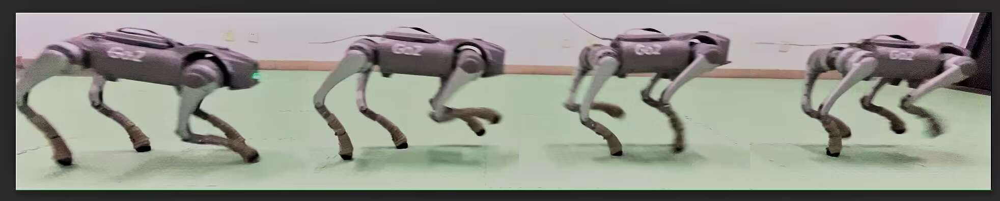

# Code and Video of EASI: Evolutionary Adversarial Simulator Identification for Sim-to-Real Transfer
 

This repository contains the code and video demonstrations of NeurIPS 2024 Conference Submission: EASI: Evolutionary Adversarial Simulator Identification for Sim-to-Real Transfer. 

The code for various experiments is placed in different branches.
- Ant: ANtWasserstein
- Ballbalance: BallWasserstein
- Cartpole:  CartpoleWasserstein

For the sim-to-real experiments, we used the Unitree Go2 as the experimental platform. The gait used in the experiments was canter.

 The introduction video for the experimental results can be found here.

