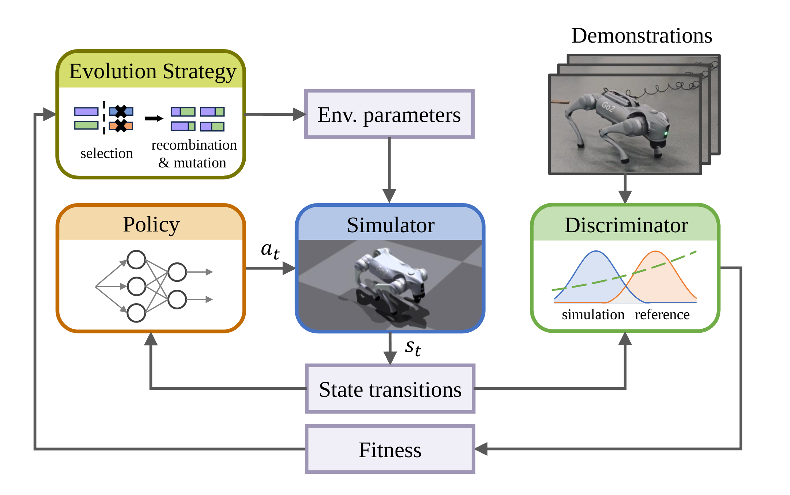
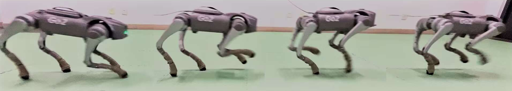
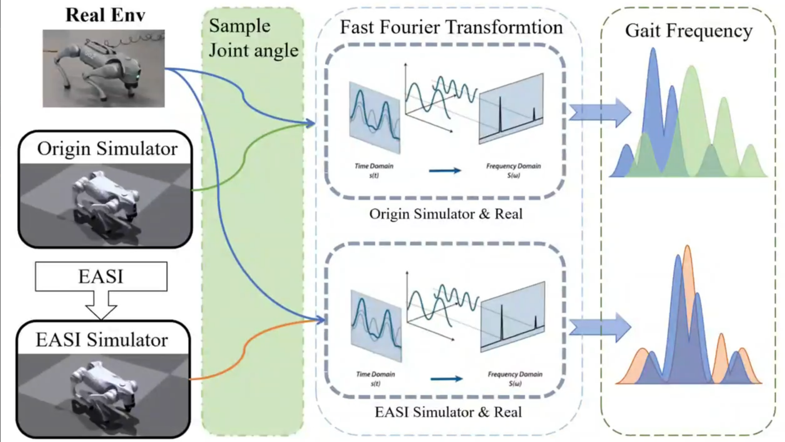

# Code and Video of EASI: Evolutionary Adversarial Simulator Identification for Sim-to-Real Transfer
 

This repository contains the code and video demonstrations of NeurIPS 2024 Conference Submission: EASI: Evolutionary Adversarial Simulator Identification for Sim-to-Real Transfer. 

For the sim-to-real experiments, we used the Unitree Go2 as the experimental platform. 

 The introduction video for the sim-to-real experimental results.
 

 Our page at：
  [OUR PAGE](https://blackvegetab1e.github.io/evolutionary_adversarial/).

## Depedence
`isaacgym` [Preview 4 Release](https://developer.nvidia.com/isaac-gym/download),
`torch`     1.13.1,
`numpy`     1.19.0,
`tensorboard`,
`argparse`.

## Test
Run python `python isaac_gym_env.py`, if everything is ok, you can see some robot tasks shown on the screen. 

Change `env_name` in `if __name__ == "__main__":` in `isaac_gym_env.py` could change the robotic tasks.

## RUN
All steps are listed in `scripts.sh`. Run those command under **~/your_location/EASI** directory.

#### 1. Train base policy using Domain Randomization. 
Using `train_policy/train_DR_Uniform.py`, you can get DR policy and trainging infos in **logs/your_env/SAC_DR/seed0-time**

args:
- env_id: which task to choose. Choose in: 'Ant', 'Cartpole', 'Ballbalance'
- num_steps: total env steps during training.
- eval_interval: Training performance record interval.
- log_mark: A str that labeling this experiment. 
- seed: random seed

#### 2. Collect state-action transition demonstration in 'real' environment.
Using `train_policy/collect_demo.py`, you can get demonstration in **logs/your_env/demonstration/WD/sizexxx_traj_lengthxxx_real_domain_cpu_seed_x.pth**

args:
- env_id: which task to choose. Choose in: 'Ant', 'Cartpole', 'Ballbalance'
- trajectory_length: Task trajectory length.
- collect_steps: Demonstration total steps.
- expert_weight: Policy used for sampling state transitions in environment. 
- seed: random seed

#### 3. Using EASI to identify parameters. 
Using `Search_gail_Gaussian.py`, you can get env param mean and var in **logs/your_env/search_gaussian/WDWD/seed_x** 

args:
- env_id: which task to choose. Choose in: 'Ant', 'Cartpole', 'Ballbalance'
- tag: A str that labeling this experiment. 
- expert_data: Demonstration used for Discriminator training.
- expert_weight: Policy used for sampling state transitions in environment. 
- trajectory_length: Task trajectory length.
- seed: random seed

#### 4. Train new policy with EASI parameters. 
Using `train_policy/train_DR_Search.py`, you can get EASI policy and trainging infos in **logs/your_env/SAC_Search/seed0-time**

args:
- env_id: which task to choose. Choose in: 'Ant', 'Cartpole', 'Ballbalance'
- num_steps: total env steps during training.
- eval_interval: Training performance record interval.
- log_mark: A str that labeling this experiment. 
- seed: random seed
- search_params_dir: The dir that have EASI parma informations.

#### 5. Evaluate
Using `train_policy/evaluate_target_domain.py`, you can evaluate policys in target domain. 

参数的详细说明在代码里有。

Detailed parameter descriptions are thoroughly introduced in the code.

Code are based on [gail-airl-ppo.pytorch](https://github.com/toshikwa/gail-airl-ppo.pytorch)
